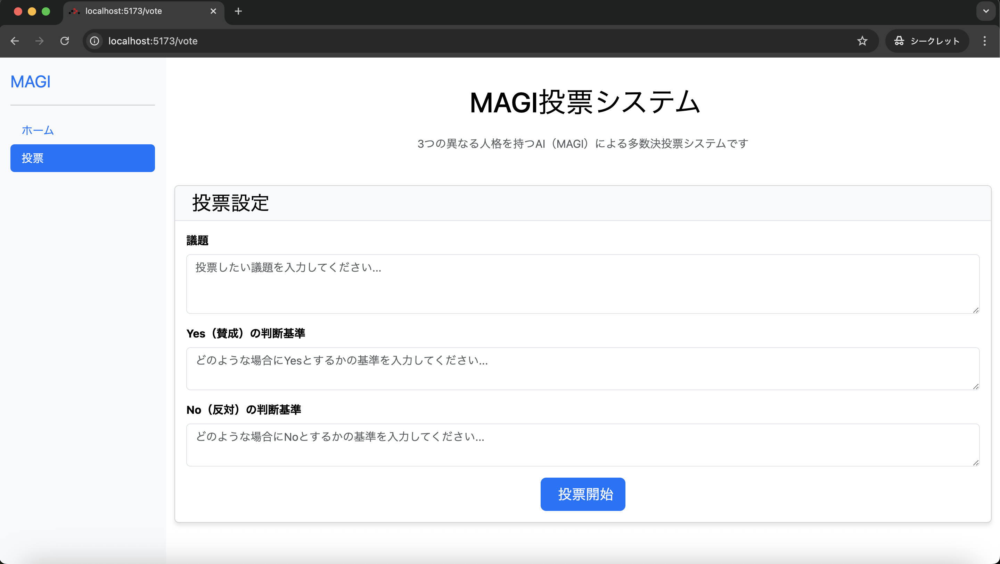
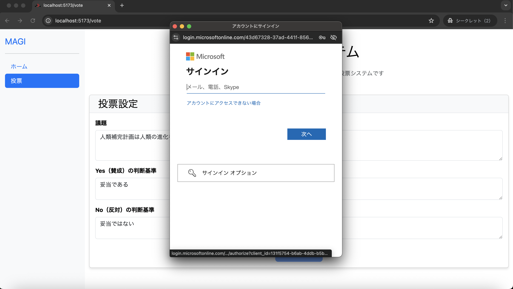

# magi-platform-spring

新世紀エヴァンゲリオンの MAGI システムを参考にした意思決定システムを構成するリポジトリです。  
定められた議題に対して、異なる人格が定義された 3 つの `賢者` (AI) が多数決により、議題の承認または否決を行います。  

このシステムは、マイクロサービスアーキテクチャを採用し、下記のマイクロサービスから構成されます。  

- magi-core: 与えられた議題に沿って、3 つの賢者 (AI) が議決を行う
- magi-bff: バックエンド (magi-core) へのアクセスを Microsoft Entra ID の OIDC 認証で管理する BFF (Backend for Frontend)
- magi-frontend: MAGI システムを操作する UI を提供する

## 概要

MAGI システムは、それぞれ異なる思考パターンを持つ 3 賢者 (GenAI) の集合知を活用し、民主的な投票を通じて意思決定を支援します。  
各賢者は、それぞれ定められたペルソナに従い、与えられた議題を分析し投票を行います。各賢者が行った投票内容を集計し、多数決により最終決定が下されます。

### 賢者

このリポジトリでは、下記の 3 つのペルソナを持つ賢者を定義しています。  

- **論理型**: 論理的かつ証拠重視、結論と簡潔な理由を示し、必要なら数値的観点やリスク評価を行う
- **慎重型**: リスク回避を優先、潜在的な問題点、リスク緩和案、保守的な判断基準を示す
- **感情型**: 人間らしい共感と価値観を重視、感情的な影響やユーザー視点での利点・懸念を示す

## クイックスタート

### 前提条件

- Visual Studio Code のインストール
- Docker インストール
- Azure AI Foundry (または Azure OpenAI Service) による GPT モデルデプロイおよび API アクセス

### 0. devcontainer の起動 (任意)

ローカルに Java と React の開発環境が構築されていない場合は、[devcontainer.json](./.devcontainer/devcontainer.json) を使用して、Dev Container を起動します。  
_※本 README は Dev Container 環境での実行を前提に記述しています。_

### 1. magi-core の起動

[magi-core](./magi-core/) ディレクトリ配下に `.env` ファイルを作成します。  
アプリケーションのポート設定、および Azure OpenAI Service や Azure AI Foundry 上でデプロイしているモデルへのアクセス情報を設定します。

```text:magi-core/magi-core/.env
SERVER_PORT=8081

AOAI_API_ENDPOINT=https://YOUR_RESOURCE_NAME.openai.azure.com/
AOAI_API_KEY=YOUR_AOAI_API_KEY
AOAI_MODEL_DEPLOYMENT_NAME=YOUR_MODEL_NAME
AOAI_MODEL_TEMPERATURE=0.7
```

`.env` ファイルを作成したら、Spring Boot アプリを起動します。  
cURL や Postman などを使用し、下記の REST API エンドポイントにアクセスし、MAGI の投票結果を取得できることを確認します。  

```bash
curl -X POST http://localhost:8081/api/magi/vote \
  -H "Content-Type: application/json" \
  -d '{
    "topic": "人類補完計画は人類の進化を完成させる手段として妥当である",
    "yesCriteria": "妥当である",
    "noCriteria": "妥当ではない"
  }'
```

### 2. magi-bff 用の Entra ID アプリを作成

magi-bff は Entra ID の OIDC 認証を使用するため、サービスプリンシパルを作成します。  

#### magi-core 用のサービスプリンシパルを作成

JWT トークンの aud/iss を検証するためのサービスプリンシパルを作成します。  

- **アプリ名**: `MAGI System (Core)`
- **サポートされているアカウントの種類**: `シングルテナント`
- **アプリケーション ID の URI**: `api://YOUR_CLIENT_ID` _※追加ボタン選択で自動発行されます_
- **この API で定義されているスコープ**:
  - **スコープ名**: `user_impersonation`
  - **同意できるのはだれですか?**: `管理者とユーザー`
  - **管理者の同意の表示名**: `Access magi-core as the signed-in user`
  - **管理者の同意の説明**: `Allows the application to call magi-core on behalf of the user.`
  - **状態**: `有効`
- **マニフェスト**: api/requestedAccessTokenVersion の値を `2` に変更

#### magi-bff 用のサービスプリンシパルを作成

magi-bff で使用する OIDC 認証用のサービスプリンシパルを作成します。  

- **アプリ名**: `MAGI System`
- **サポートされているアカウントの種類**: `シングルテナント`
- **リダイレクト URI**:
  - **プラットフォーム**: `シングルページ アプリケーション`
  - **URL**: `http://localhost`
- **証明書とシークレット**: `シークレットを発行` _※発行後に表示される値を必ず保存すること_
- **API のアクセス許可**:
  - **所属する組織で使用している API**: `MAGI System (Core)`
    - **アクセス許可**: `user_impersonation`
- **マニフェスト**: api/requestedAccessTokenVersion の値を `2` に変更

### 3. magi-bff の起動

[magi-bff](./magi-bff/) ディレクトリ配下に `.env` ファイルを作成します。  

```text:magi-bff/magi-bff/.env
SERVER_PORT=8080
AZURE_CLIENT_ID=YOUR_CLIENT_ID_MAGI_BFF
AZURE_CLIENT_SECRET=YOUR_CLIENT_SECRET_MAGI_BFF
AZURE_TENANT_ID=YOUR_ENTRA_TENANT_ID
AZURE_CLIENT_AUD_ID=YOUR_CLIENT_ID_MAGI_CORE
AZURE_ISSUER_URI=https://login.microsoftonline.com/YOUR_ENTRA_TENANT_ID/v2.0
SPRING_APPLICATION_NAME=MagiSystem-BFF
MAGI_CORE_BASE_URL=http://localhost:8081/api/magi
MAGI_CORE_USE_DAPR=false
MAGI_CORE_DAPR_APP_ID=magi-core
LOG_LEVEL=INFO
```

`.env` ファイルを作成したら、Spring Boot アプリを起動します。  
cURL や Postman などを使用し、`MAGI System (BFF)` のOIDC 認証を行います。  
認証後、取得した Bearer トークンをヘッダーに組み込み、下記の REST API エンドポイントにアクセスし、MAGI の投票結果を取得できることを確認します。  

```bash
curl -X POST http://localhost:8080/api/core/magi/vote \
  -H "Content-Type: application/json" \
  -H "Authorization: Bearer YOUR_ACCESS_TOKEN" \
  -d '{
    "topic": "人類補完計画は人類の進化を完成させる手段として妥当である",
    "yesCriteria": "妥当である",
    "noCriteria": "妥当ではない"
  }'
```

Postman を使用して Bearer トークンを取得する際は、`MAGI System` サービスプリンシパルのリダイレクト URL に Postman 用のリダイレクト URL (種別は Web) を入れることを忘れないでください。  

### 4. magi-frontend の起動

[src](./magi-frontend/src/) ディレクトリ配下に `.env.local` を作成します。  
アプリの実行に必要な環境変数を定義します。  

```text:magi-frontend/src/.env.local
VITE_AZURE_CLIENT_ID=YOUR_CLIENT_ID_MAGI_BFF
VITE_AZURE_AUTHORITY=https://login.microsoftonline.com/YOUR_ENTRA_TENANT_ID
VITE_API_SCOPE=api://YOUR_CLIENT_ID_MAGI_CORE/user_impersonation
VITE_REDIRECT_URI=http://localhost:5173
VITE_API_BASE=http://localhost:8080
VITE_API_PROXY_TARGET=http://localhost:8080
```

`.env.local` ファイルを作成したら、React Router v7 アプリを起動します。  

```bash
npm run dev
```

### 5. MAGI システムにアクセス

ブラウザで http://localhost:5173/vote にアクセスし、MAGI システムが表示されることを確認します。  



MAGI システムに審議してほしいことを入力し、`投票開始` ボタンを選択します。  
Microsoft アカウントの認証情報入力のポップアップが起動します。(すでに本アプリで認証済みの場合は SSO されます)



認証が完了し、MAGI システム (Azure OpenAI) が回答を作成すると、画面下部に投票結果が表示されます。  


## 技術スタック

- Java (21 LTS)
- TypeScript (Node - 22 LTS)
- Spring Boot / Spring Security / Spring AI
- React Router v7
- Azure OpenAI
- @azure/msal-browser
- Bootstrap 5

## ライセンス

このプロジェクトは MIT ライセンスの下でライセンスされています - 詳細は [LICENSE ファイル](./LICENSE) を参照してください。

## 参考リポジトリ

このリポジトリは、下記のリポジトリで公開された内容を参考に、Java および Spring AI 、React Router v7 による改良を行ったものです。  

- [07JP27/MagiSystem](https://github.com/07JP27/MagiSystem)
